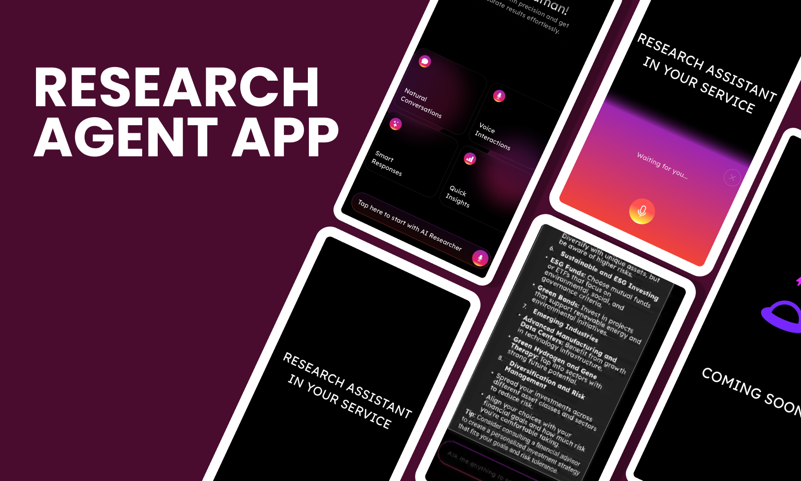
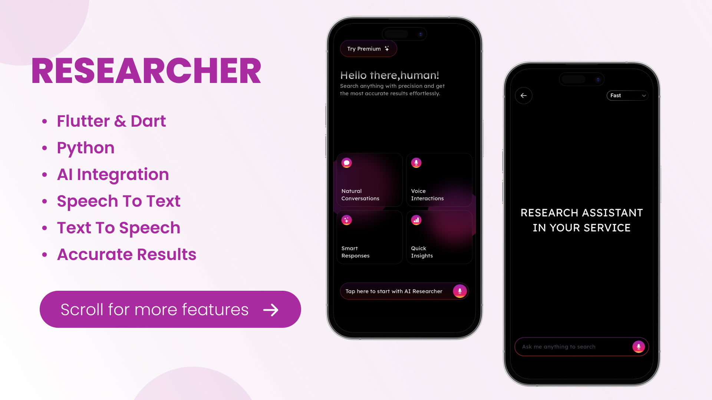
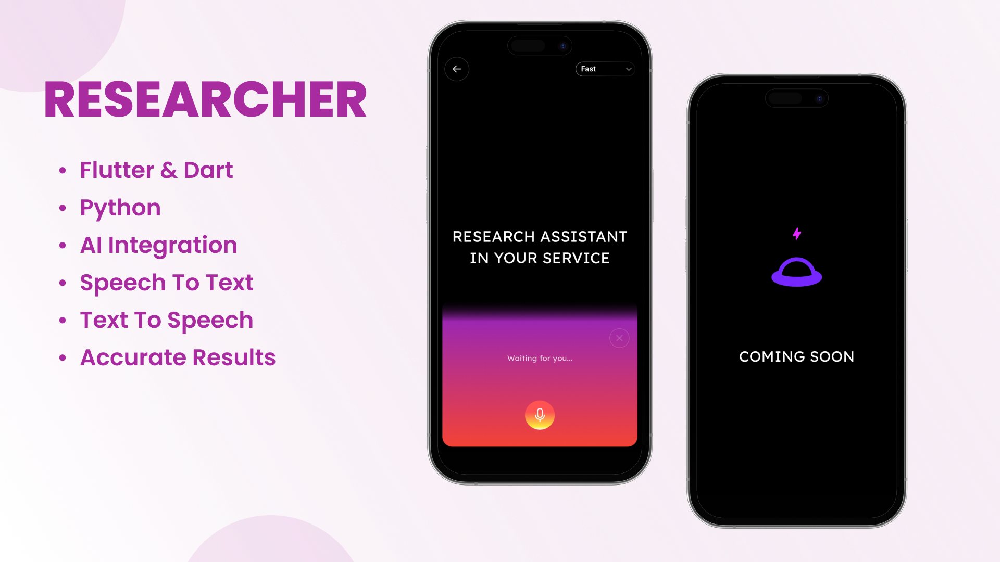

# 🤖 Researcher – AI-Powered Research Agent

Researcher is an intelligent, voice-interactive mobile application built with Flutter that connects to a powerful AI agent backend. It's designed to help users gather deep, comprehensive information on complex questions through a natural, conversational interface.

Ask questions with your voice, and get spoken answers back. The app leverages a sophisticated FastAPI backend powered by an OpenAI agent to deliver insights in real-time.

✨ Core Features
🎙️ Voice-to-Text Input – Ask complex questions naturally using your voice with integrated, high-accuracy speech-to-text.

🔊 Text-to-Speech Output – Listen to the AI's detailed answers, turning research into a hands-free, conversational experience.

⚡ Dual Research Modes – Choose between two distinct modes for your queries:

Fast Mode: Get quick, concise answers for on-the-spot information.

Deep Mode: Trigger a more thorough research process for in-depth, detailed analysis.

💬 Real-time Chat Interface – Interact with the AI through a responsive chat UI built on WebSockets for instant, bi-directional communication.

🌙 Modern UI with Light & Dark Themes – A sleek and intuitive interface that is easy on the eyes, day or night.

📱 Cross-Platform – Built with Flutter for a seamless experience on both Android and iOS devices.

📸 App Screenshots
Here are some previews of the Researcher app in action.

(You can replace these placeholders with your actual screenshots.)

🛠️ Tech Stack & Architecture
Frontend (Mobile App):

Framework: Flutter (Dart)

State Management: Bloc / Provider

Real-time Communication: web_socket_channel

Voice I/O: speech_to_text, flutter_tts

Backend (AI Core):

Framework: FastAPI (Python)

AI Engine: Custom Agent built with OpenAI's API

Communication Protocol: WebSockets

🎯 Project Goal
The "Researcher" agent was built to explore the future of information retrieval. The goal was to move beyond simple keyword searches and create an assistant that can understand complex, nuanced questions and perform deep research, all accessible through the most natural interface: our voice. This project serves as an MVP demonstrating the power of combining modern mobile development with advanced AI agents.

📬 Contact Me
💡 Have questions, ideas, or want to collaborate? Reach out to me!

<b> Elmehdi Elouissi </b> : [Github](https://www.github.com/dadixcod) | [LinkedIn](https://www.linkedin.com/in/dadixcod)

👨‍💻 Developed with ❤️ using Flutter & FastAPI